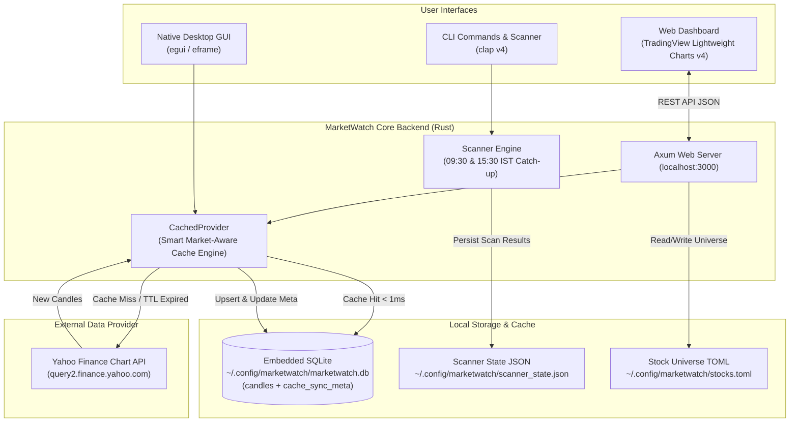

# System Architecture Documentation

## 1. High-Level Architecture

MarketWatch is a personal stock market visualization and top-movers tracking terminal built in **Rust 2024**. It provides both an embedded **Web Terminal Dashboard** (localhost:3000) and a **Native GUI** (`egui`/`eframe`), along with scheduled systemd automated scanning for Indian markets (NSE/BSE).



---

## 2. Component Breakdown

### A. Web Terminal Dashboard (`src/web/`)
* **Single-Page Application**: Embedded directly into the Rust binary at compile-time using `include_str!("index.html")`. Zero external file dependencies to deploy or run.
* **Charting Library**: TradingView Lightweight Charts (v4.2.1) loaded from CDN.
* **Modern Dual-Sidebar / Rail Layout (v2)**:
  * **⚡ Slim Navigation Rail (56px)**: Quick toggle between Single Chart, Multi-Chart Grid, Watchlist Drawer, Intel Drawer, Theme switcher, and Command Palette (<kbd>Ctrl+K</kbd>).
  * **🎛️ Minimalist Top Bar**: Live symbol & percentage pill, segmented timeframe switchers (`5m` to `1w`), zoom dial, cache status badge, and drawer triggers.
  * **🧠 Collapsible Intel & System Drawer**:
    * **AI Insights**: Algorithmic pivot levels (Classic P, R1, R2, S1, S2) and live candlestick pattern recognition (Engulfing, Hammer, Doji).
    * **Fundamentals**: Ticker statistics, market exchange, loaded bar count, and data freshness.
    * **System & Logs**: 1-click copyable systemctl commands, live journalctl logs monitor, and SQLite cache stats.
  * **🔍 Dynamic Zoom Dial**: Adjustable candle spacing dial (1 to 10 pixels), persisted via `localStorage`.
  * **Broker-Style Crosshair & Hover Tooltip**: Real-time candle percentage change badge displayed directly at the cursor and in the header OHLC banner.
  * **Right-Side Candle Padding**: Last candle offset away from Y-axis for easy future-projection reading.
  * **Top 150 Watchlist & Screener**: Live search, category badges, top movers filtering (gainers/losers by 1%, 2%, 3%, 5% threshold).
  * **Multi-Chart Grid Mode**: View mini-charts for all market movers simultaneously.

### B. Storage & Caching Layer (`src/storage/` & `src/provider/cached.rs`)
* **`MarketDb`**: Embedded SQLite wrapper managing connection pooling with WAL mode and transaction-safe upserts.
* **`CachedProvider`**: Decorator pattern wrapping any `MarketDataProvider`. Implements market-aware cache validation:
  * **Market Closed**: Never queries Yahoo Finance if data was synced after the latest 15:30 IST market close.
  * **Market Open**: Enforces a 60-second freshness TTL to prevent redundant network calls during active chart browsing.
  * **Offline Resilience**: Gracefully serves stored historical candles if network drops or API rate-limits.

### C. Market Data Provider (`src/provider/yahoo.rs`)
* Handles raw HTTP communication with Yahoo Finance chart APIs (`query2` / `query1`).
* Translates raw JSON into application domain [`Candle`](file:///home/kiran/work/Rust/MarketWatch/src/domain/candle.rs) and [`StockMover`](file:///home/kiran/work/Rust/MarketWatch/src/domain/mover.rs) structs.

### D. Automated Scheduler & Service (`src/scanner/`)
* Runs automated universe scans at **09:30 AM** (morning session) and **03:30 PM** (market close) IST.
* Includes persistent **missed-scan catch-up**: If the laptop was turned off during the scheduled time, running or launching MarketWatch automatically detects the missed slot and performs the scan.
* Generates native desktop notifications via `notify-send`.

---

## 3. Web API Endpoints Reference

All endpoints return JSON responses.

| Method | Endpoint | Query Parameters | Description |
| :--- | :--- | :--- | :--- |
| `GET` | `/` | None | Serves embedded single-page dashboard HTML |
| `GET` | `/favicon.svg` | None | Serves application SVG favicon |
| `GET` | `/api/stocks` | None | Lists all stocks in the universe configuration |
| `POST` | `/api/stocks` | JSON body: `StockEntry` | Adds a new stock to the universe |
| `DELETE`| `/api/stocks/{symbol}` | Path: `symbol` | Removes a stock from the universe |
| `GET` | `/api/candles` | `symbol`, `timeframe`, `force` (optional) | Retrieves OHLCV candle bars (checks SQLite cache first) |
| `GET` | `/api/cache/meta` | `symbol`, `timeframe` | Returns cache synchronization metadata for the pair |
| `GET` | `/api/scan` | `threshold`, `force` | Runs or returns a live mover scan across all stocks |
| `GET` | `/api/scan/cached` | None | Retrieves the most recent scan result from disk cache |
| `GET` | `/api/scan/state` | None | Returns cron schedule and catch-up execution state |

---

## 4. File Structure

```
MarketWatch/
├── Cargo.toml                  # Dependencies (rusqlite, axum, tokio, egui, clap)
├── docs/                       # Project documentation
│   ├── architecture.md         # System architecture & component guide
│   └── database_schema.md      # SQLite schema, indices, and freshness rules
├── src/
│   ├── main.rs                 # CLI entrypoint and mode dispatcher
│   ├── app.rs                  # Application orchestration for CLI & GUI
│   ├── cli.rs                  # Command-line argument parsing
│   ├── config.rs               # Stock universe TOML loader/saver
│   ├── error.rs                # Typed MarketError definitions
│   ├── domain/                 # Core domain entities
│   │   ├── candle.rs           # Normalized Candle struct (OHLCV)
│   │   ├── mover.rs            # StockMover representation
│   │   └── timeframe.rs        # Timeframe enum (5m, 15m, 30m, 1h, 1d, 1w)
│   ├── provider/               # Data provider implementations
│   │   ├── mod.rs              # MarketDataProvider trait
│   │   ├── cached.rs           # CachedProvider SQLite wrapper
│   │   └── yahoo.rs            # Yahoo Finance HTTP provider
│   ├── scanner/                # Screener and cron automation
│   │   ├── mod.rs              # Multi-threaded batch scanner
│   │   ├── notifier.rs         # Desktop notification dispatcher
│   │   ├── service.rs          # Systemd unit generator and manager
│   │   └── state.rs            # ScanState persistence and catch-up logic
│   ├── storage/                # Database persistence
│   │   └── mod.rs              # MarketDb SQLite engine with WAL mode
│   ├── ui/                     # Native GUI
│   │   ├── chart.rs            # egui candlestick chart rendering
│   │   └── mod.rs
│   └── web/                    # Embedded Web Dashboard
│       ├── mod.rs              # Axum HTTP routes and handlers
│       ├── index.html          # Frontend HTML/CSS/JavaScript
│       └── favicon.svg         # SVG Favicon
```
