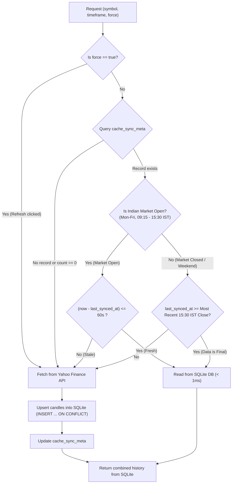

# Database Schema Documentation

## Overview

MarketWatch uses an embedded **SQLite** database (`marketwatch.db`) for caching historical candlestick (OHLCV) market data and tracking cache synchronization metadata.

- **Storage Location**:
  - Primary: `~/.config/marketwatch/marketwatch.db`
  - Local Fallback: `./cache/marketwatch.db`
- **Engine**: SQLite 3 (compiled statically into binary via `rusqlite` bundled)
- **Concurrency Mode**: **WAL (Write-Ahead Logging)** enabled (`PRAGMA journal_mode = WAL; PRAGMA synchronous = NORMAL;`) for microsecond read latency (< 0.2ms) and non-blocking concurrent reads/writes.

---

## Tables

### 1. `candles` (Time-Series Store)

Stores individual OHLCV candlestick bars across all tracked stocks and timeframes.

```sql
CREATE TABLE IF NOT EXISTS candles (
    symbol          TEXT    NOT NULL,
    timeframe       TEXT    NOT NULL,
    timestamp       INTEGER NOT NULL,
    open            REAL    NOT NULL,
    high            REAL    NOT NULL,
    low             REAL    NOT NULL,
    close           REAL    NOT NULL,
    volume          INTEGER NOT NULL,
    PRIMARY KEY (symbol, timeframe, timestamp)
) WITHOUT ROWID;

CREATE INDEX IF NOT EXISTS idx_candles_lookup 
ON candles (symbol, timeframe, timestamp ASC);
```

#### Columns

| Column | Type | Nullable | Description |
| :--- | :--- | :--- | :--- |
| `symbol` | TEXT | NO | NSE stock symbol with `.NS` suffix (e.g. `'RELIANCE.NS'`, `'TCS.NS'`) |
| `timeframe` | TEXT | NO | Timeframe interval code (`'5m'`, `'15m'`, `'30m'`, `'1h'`, `'1d'`, `'1w'`) |
| `timestamp` | INTEGER | NO | Unix epoch timestamp in seconds (start of the candlestick period) |
| `open` | REAL | NO | Opening price during the period (₹) |
| `high` | REAL | NO | Highest price traded during the period (₹) |
| `low` | REAL | NO | Lowest price traded during the period (₹) |
| `close` | REAL | NO | Closing / last traded price during the period (₹) |
| `volume` | INTEGER | NO | Number of shares traded during the period |

#### Key Design Decisions

* **Composite Primary Key `(symbol, timeframe, timestamp)`**: Guarantees that duplicate bars for the same point in time cannot exist.
* **`WITHOUT ROWID`**: Optimizes B-tree storage by eliminating the hidden 64-bit rowid integer, saving disk space and speeding up range scans on composite primary keys.
* **`ON CONFLICT ... DO UPDATE` (Upsert)**: When new data arrives, an unclosed / forming candle updates its `high`, `low`, `close`, and `volume` in-place without duplicating rows.

---

### 2. `cache_sync_meta` (Sync Metadata & Freshness Tracker)

Stores synchronization state per `(symbol, timeframe)` pair. There is exactly one row per stock per timeframe (~900 small rows total for 150 stocks across 6 timeframes).

```sql
CREATE TABLE IF NOT EXISTS cache_sync_meta (
    symbol          TEXT    NOT NULL,
    timeframe       TEXT    NOT NULL,
    last_synced_at  INTEGER NOT NULL,
    first_candle_ts INTEGER NOT NULL,
    last_candle_ts  INTEGER NOT NULL,
    candle_count    INTEGER NOT NULL,
    PRIMARY KEY (symbol, timeframe)
);
```

#### Columns

| Column | Type | Nullable | Description |
| :--- | :--- | :--- | :--- |
| `symbol` | TEXT | NO | NSE stock symbol (e.g. `'RELIANCE.NS'`) |
| `timeframe` | TEXT | NO | Timeframe code (e.g. `'15m'`) |
| `last_synced_at` | INTEGER | NO | Unix epoch timestamp of when Yahoo Finance API was last queried |
| `first_candle_ts` | INTEGER | NO | Timestamp of earliest stored candle for this symbol & timeframe |
| `last_candle_ts` | INTEGER | NO | Timestamp of latest stored candle for this symbol & timeframe |
| `candle_count` | INTEGER | NO | Total number of candles stored in the `candles` table |

---

## Cache Freshness & Validation Algorithm

When a request for candles is received (`/api/candles?symbol=XYZ&timeframe=15m`), the system executes the following market-aware validation:



### Network Fallback
If the network drops or Yahoo Finance rate-limits (HTTP 429), the provider catches the error and serves the existing SQLite cached candles rather than throwing an error to the user.

---

## Example Queries

### Read Candles (Ascending Time)
```sql
SELECT timestamp, open, high, low, close, volume 
FROM candles 
WHERE symbol = 'RELIANCE.NS' AND timeframe = '15m' 
ORDER BY timestamp ASC;
```

### Upsert Candle Bar
```sql
INSERT INTO candles (symbol, timeframe, timestamp, open, high, low, close, volume)
VALUES ('RELIANCE.NS', '15m', 1790057200, 1243.30, 1252.70, 1242.50, 1248.20, 654707)
ON CONFLICT(symbol, timeframe, timestamp) DO UPDATE SET
    open = excluded.open,
    high = excluded.high,
    low = excluded.low,
    close = excluded.close,
    volume = excluded.volume;
```

### Update Sync Metadata
```sql
INSERT INTO cache_sync_meta (symbol, timeframe, last_synced_at, first_candle_ts, last_candle_ts, candle_count)
VALUES ('RELIANCE.NS', '15m', 1790057205, 1789530300, 1790057202, 111)
ON CONFLICT(symbol, timeframe) DO UPDATE SET
    last_synced_at  = excluded.last_synced_at,
    first_candle_ts = excluded.first_candle_ts,
    last_candle_ts  = excluded.last_candle_ts,
    candle_count    = excluded.candle_count;
```
